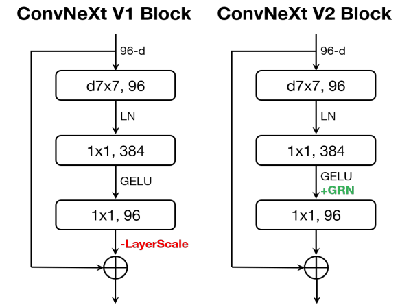

# PyTorch Implementation of ConvNeXt V2 (for performance comparison in paper "Multihead Neural Network for Multiple Segmented Images-based Diagnosis of Thyroid-associated Orbitopathy Activity.")
 
The preprocessing and architecture can be referenced by a manuscript entitled, "Convnext v2: Co-designing and scaling convnets with masked autoencoders." 

## Overview
This repository contains an unofficial implementation of ConvNeXt V2 using PyTorch.<br/>


## Neural Network Block

## Paper
If you use this software for your research, please cite:

```bibtex
@inproceedings{woo2023convnext,
  title={Convnext v2: Co-designing and scaling convnets with masked autoencoders},
  author={Woo, Sanghyun and Debnath, Shoubhik and Hu, Ronghang and Chen, Xinlei and Liu, Zhuang and Kweon, In So and Xie, Saining},
  booktitle={Proceedings of the IEEE/CVF Conference on Computer Vision and Pattern Recognition},
  pages={16133--16142},
  year={2023}
}
```

## License
This program is available for download for non-commercial use, licensed under the GNU General Public License. This allows its use for research purposes or other free software projects but does not allow its incorporation into any type of commercial software.

## Files
The repository contains the following files:
- `ConvNeXtV2.py`: Python script file, containing the PyTorch implementation of the ConvNeXtV2
- `ConvNeXtV2_Block.png`: Figure file for network block
- `README.md`: Markdown file explaining the model source code
